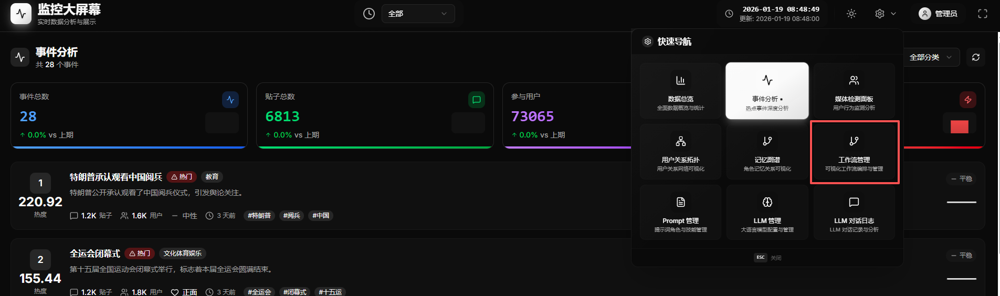
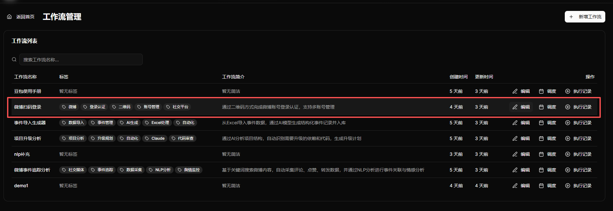
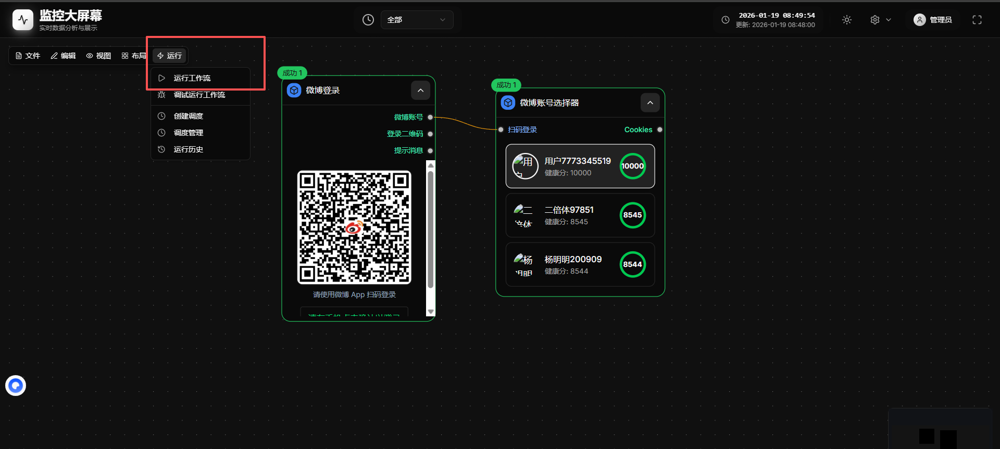

# 数据爬取组工作流程

地址：http://43.240.223.138:18088/workflow-management

## 组成人员

**组长：** 张祺悦
**成员：** 李琦睿、刘艳灵

## 核心职责

1. 微博账号登录管理
2. 事件录入
3. 系统基础操作熟练使用

---

## 工作流程

### 一、账号登录管理

#### 1.1 账号准备
- 准备有效的微博账号（建议使用小号，避免主账号风险）
- 确保账号状态正常，未被封禁或限制

#### 1.2 登录流程
1. 打开系通中微博登录工作流
2. 扫码登录账号

#### 1.3 账号维护
- 每日检查账号状态
- 发现健康度差的账号及时重新登录账号

### 二、事件录入

#### 2.1 事件信息收集
- 确定事件名称
- 收集事件相关关键词
- 确定时间范围

#### 2.2 事件创建流程
1. 打开系统中 事件导入生成器 工作流
2. 打开侧边栏导入事件excel
3. 运行工作流，等待导入结束

### 三、日常操作规范

#### 3.1 每日检查清单
- [ ] 检查账号登录状态
- [ ] 查看待处理事件

#### 3.2 任务监控
- 实时关注爬取进度
- 记录爬取数据量

## 联系方式

| 姓名 | 联系方式 | 备注 |
|-----|---------|-----|
| 张祺悦 | 18514233865 | 组长 |
| 李琦睿 | 15610476771 | |
| 刘艳灵 | 13409118461 | |
